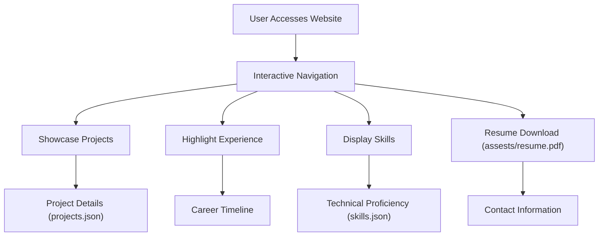

# 🚀 Dynamic Portfolio Website

<p align="center"></p>

## Short Description
Welcome to a modern, responsive, and highly customizable personal portfolio website designed to make a powerful first impression. This project serves as a comprehensive digital showcase, brilliantly highlighting skills, experience, and projects through an engaging user interface. Crafted with clean code and a focus on user experience, it's the perfect platform for developers, designers, or any professional looking to present their work online with impact.

## ✨ Key Features
*   **Interactive & Responsive UI:** A sleek, modern design that adapts seamlessly to all devices, ensuring an optimal viewing experience for every visitor.
*   **Comprehensive Project Showcase:** Dedicated sections to exhibit your projects with detailed descriptions, demonstrating your technical prowess and creativity. Data-driven content managed via `projects/projects.json`.
*   **Professional Experience Timeline:** Present your career journey and professional milestones in a clear, engaging timeline format.
*   **Dynamic Skills Section:** Highlight your technical proficiencies and core competencies, making it easy for visitors to grasp your capabilities. Content is managed via `skills.json`.
*   **Downloadable Resume:** Provides a direct link for potential employers or collaborators to access your full resume (`assests/resume.pdf`).
*   **Integrated CI/CD Workflow:** Automated deployment and testing powered by GitHub Actions (`.github/workflows/ci-cd.yml`) ensures a smooth, efficient development and release cycle.
*   **Custom 404 Page:** A branded and user-friendly custom error page for enhanced user experience.

## Who is this for?
This portfolio website is ideal for:
*   **Software Developers:** Showcase your coding projects, technical skills, and career path.
*   **UI/UX Designers:** Display your design portfolio, case studies, and creative process.
*   **Freelancers & Consultants:** Market your services and expertise to potential clients.
*   **Students & Graduates:** Create a strong online presence for job applications and networking.
*   Anyone looking to establish a robust and professional digital identity.

## Technology Stack & Architecture
This project is built using a robust and widely adopted set of web technologies, ensuring high performance, maintainability, and accessibility.

*   **Frontend Development:**
    *   **HTML5:** For semantic structure and content organization.
    *   **CSS3:** Styling and visual presentation, including responsive design principles.
    *   **JavaScript (ES6+):** For interactive elements, dynamic content loading, and engaging user experiences (e.g., `particles.min.js` for visual effects).
*   **Content Management:**
    *   **JSON:** Simple, lightweight data interchange format used for managing project details (`projects/projects.json`) and skills information (`skills.json`), making content updates straightforward.
*   **Continuous Integration/Continuous Deployment (CI/CD):**
    *   **GitHub Actions:** Automated workflows for building, testing, and deploying the website, ensuring efficient and reliable updates.

## 📊 Architecture & Database Schema
Given this is a static portfolio website, there is no traditional backend database schema. The architecture focuses on client-side rendering and efficient content delivery.

Here’s a simplified user flow representing the website's high-level architecture:



## ⚡ Quick Start Guide
Getting this portfolio website up and running is incredibly simple:

1.  **Clone the Repository:**
    ```bash
    git clone https://github.com/dhanu868842/portfolio_website.git
    cd portfolio_website
    ```
2.  **Open in Browser:**
    Simply open the `index.html` file in your preferred web browser. All content is served directly from the local files.
    ```bash
    # Example (macOS/Linux)
    open index.html
    # Example (Windows)
    start index.html
    ```
3.  **Customize Your Content:**
    *   Edit `projects/projects.json` to add or update your projects.
    *   Modify `skills.json` to reflect your current skill set.
    *   Update `assests/resume.pdf` with your latest resume.
    *   Personalize the `index.html`, `experience/index.html`, and `projects/index.html` files, along with the CSS (`assests/css/style.css`) and JavaScript (`assests/js/app.js`) files to match your brand and style.

## 📜 License
This project is licensed under the terms found in the `LICENSE` file in the root of this repository.